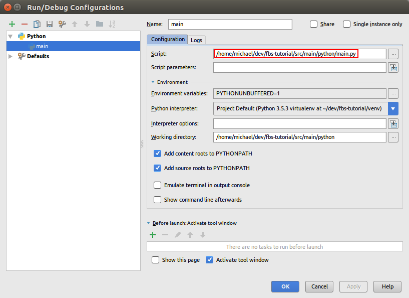

# Analysis of allocation of antenna coverage


### Visualização do software:


### Configuração para desenvolvimento:

:exclamation: Atenção, só é possível executar o fbs utilizando a versão 3.6 do python. :exclamation:

-  Dependências Linux
```shell script
sudo apt update
sudo apt install -y \
                 software-properties-common \
                 libpcre3 libpcre3-dev \
                 libpython3-all-dev \
                 python3-distutils \
                 build-essential \
                 libpython3-dev \
                 python3-pip \
                 python3-pyqt5.qtwebengine \
                 g++ 
```

- Crie um ambiente e instale dependências Python

```shell script
pip3 install virtualenv
virtualenv venv
source venv/bin/activate
pip install -r requirements.txt
```

- Configure o arquivo de variáveis de ambiente

```shell
cp .env.example .env
```

- Usando a IDE PyCharm

O comando ``fbs run`` via terminal é ótimo para executar seu aplicativo rapidamente. 
Muitas pessoas, entretanto, preferem trabalhar em um IDE como o PyCharm. Isso simplifica especialmente a depuração.

Para executar um aplicativo fbs de outros ambientes (como um IDE ou a linha de comando), você simplesmente.

- precisa que o ambiente virtual esteja ativo,
- ter ``src/main/python`` em seu ``PYTHONPATH`` e
- executar o arquivo ``src/main/python/main.py``.

Por exemplo, no Mac e Linux, você também pode executar seu aplicativo a partir da linha de comando via (assumindo que o ambiente virtual está ativo).:

```shell
PYTHONPATH=src/main/python python src/main/python/main.py
```

Aqui estão as capturas de tela de como o PyCharm pode ser configurado para isso:




Veja mais em: [https://build-system.fman.io/manual/](https://build-system.fman.io/manual/)


### Comandos para deploy

```shell
fbs freeze
fbs installer
sudo dpkg -i target/analysis-of-antenna-coverage.deb
sudo dpkg --purge analysis-of-antenna-coverage
```

