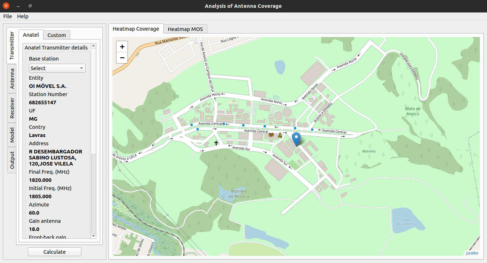

# Analysis of allocation of antenna coverage


### Preview of software:



### Setup for development

-  Linux dependencies
```shell script
$ sudo apt update
$ sudo apt install -y \
                 software-properties-common \
                 libpcre3 libpcre3-dev \
                 libpython3-all-dev \
                 python3-distutils \
                 build-essential \
                 libpython3-dev \
                 python3-pip \
                 python3-pyqt5.qtwebengine \
                 qttools5-dev-tools \
                 qttools5-dev \
                 g++ 
```

- Create environment and install python dependencies

```shell script
$ pip3 install virtualenv
$ virtualenv venv
$ source venv/bin/activate
$ pip install -r requirements.txt
```

- Configure the environment variables file

```shell
$ cp .env.example .env
```

- USING IN IDE

The command ``fbs run`` is great to quickly run your app. Many people however prefer working in an IDE such as PyCharm. It especially simplifies debugging.

To run a fbs app from other environments (such as an IDE, or the command line), you simply

- need the virtual environment to be active,
- have src/main/python on your PYTHONPATH and
- run src/main/python/main.py.

So for example on Mac and Linux, you can also run your app from the command line via

```shell
PYTHONPATH=src/main/python python src/main/python/main.py
```

Here are screenshots of how PyCharm can be configured for this:


See more in: [https://build-system.fman.io/manual/](https://build-system.fman.io/manual/)


### For deploy

```shell
$ fbs freeze
$ fbs installer
$ sudo dpkg -i target/analysis-of-antenna-coverage.deb
$ sudo dpkg --purge analysis-of-antenna-coverage
```


### For modify the application layout

```shell
$ designer
```

